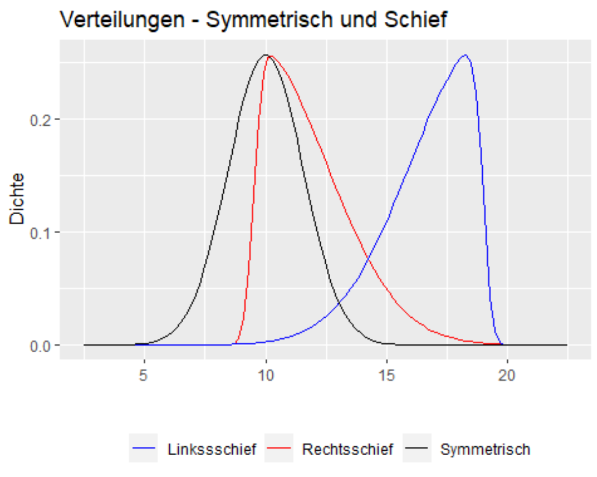
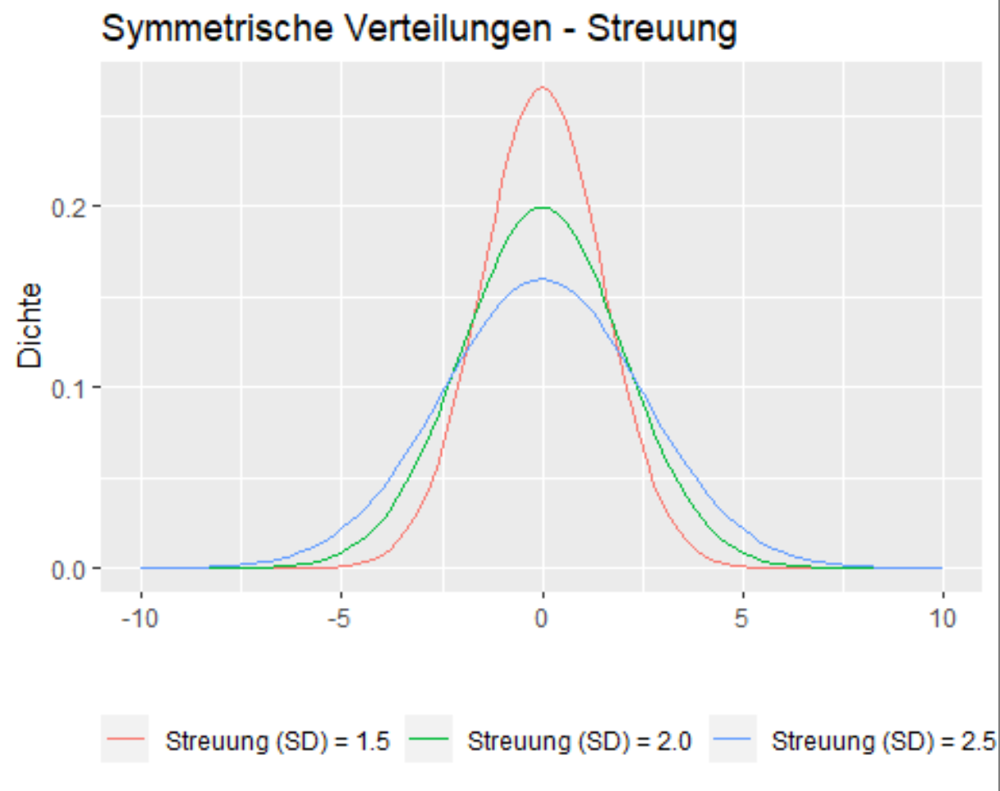

# Deskriptive Statistik

## Grundbegriffe

* Diskrete Merkmale: eine abzählbare Menge (bsp. Schulnoten, Teilnehmer)
* Stetige Merkmale: unendliche viele Ausprägungen (z.B. Strecke)

* Nominale Daten: keine Rangordnung
* Ordinale Daten: Rangordnung (Schulnoten, usw.)

* univariat Statistiken: Masszahlen welche sich auf ein einziges Merkmal beziehen. Hauptsächlich Masse, welche die zentrale Lage einer Verteilung charakterisieren (Mittelwert) und die Streuung der Daten
* bivariate Statistiken: den Zusammenhang zwischen zwei Merkmalen

## Verteilungen

Daten können unterschiedlich verteilt sein. Wir unterscheiden folgende Masszahlen:

* Lagemasse
* Streumasse
* Symmetrie- oder Schiefemasse
* Wölbungsmasse

## Lagemasse

### Arithmetisches Mittel

* $\overline{x}=\frac{1}{n}\sum_{i=1}^{n} x_{i}$
* Schwerpunkt der Daten: Werte aufsummieren und durch die Anzahl Werte n divieren
* R Syntax: mean(x, trim=0)
* Einfach zu berechnen
* nicht robust
* nimmt Werte an die in der Population nicht vorkommen
* Wird durch das 1. Moment quantifiziert

### Gestutztes Mittel

* $x_{trim}$
* alle Werte sortiert, m grösste und m kleisnte Werte entfernt, anschliessend Summer restliche Werte durch Anzahl Werte dividiert
* R Syntax:

```r
mean(x, trim= 0.1)
```

* weniger einfach zu berechnen
* relativ robust
* nimmt Werte an die in der Population nicht vorkommen

### Median

* $x_{med}$
* alle Werte sortieren, mittleren Wert wählen
* R Syntax:

```r
median(x, na.rm = FALSE)
```

* sehr robust
* nimmt Werte an die in der Population vorkommen
* es muss sich um ordinale Daten handeln

### Modus

* $x_{mod}$
* Häuftigsten Wert wählen
* es gibt dafür R Pakete
* robust, falls Stichprobe nicht zu klein
* nimmt Werte an die$ in der Population vorkommen, nicht immer eindeutig

Arithmetisches Mittel, Median und Modus können gebraucht werden, um Schiefe der Verteilung zu beurteilen

* Symmetrische Verteilung: $\overline{x}\approx x_{med}\approx x_{mod}$
* Rechtsschief (=linkssteile) Verteilung: $\overline{x}>x_{med}>x_{mod}$
* Linksschiefe (=rechtssteile) Verteilung: $\overline{x}<x_{med}<x_{mod}$

## Streumasse

### Empirische Varianz

* Wird durch das 2. Moment quantifiziert
* $var=s_x^2=\frac{1}{n}\sum_{i=1}^{n} (x_i-\overline{x})^2$
* Durchschnittliche quadrierte Abweichung vom arithemtischen Mittel aufsummiert und durch Anzahl Werte dividiert
* R Syntax:

```r
var(x, na.rm = FALSE)
```

### Empirische Standardabweichung

* $s_x=\sqrt{\frac{1}{n}\sum_{i=1}^{n} (x_i-\overline{x})^2}$
* Wurzel der empirischen Varianz
* R Syntax: sd(x, na.rm = FALSE)

### Quartilsdifferenz

* $IQR=x_{p75}-x_{p25}$
* Differenz von 3. Quartil und 1. Quartil berechnen
* R Syntax:

```r
IQR(x, na.rm = FALSE)
```

### Medianabweichung

* $x_{MAD}=med(|x_i-x_{med}|)$
* Median der absoluten Differenz um Median
* R Syntax:

```r
mad(x, constant = 1.4826, na.rm = FALSE)
```

### Variationskoeffizient

* $cv=\frac{s_x}{\overline{x}}$
* Quotient aus Standardabweichung und Mittelwert
* Ermöglicht den Vergleich von verschiedenen Standardabweichungen, die unterschiedliche Mittelwerte besitzen

## Symmetrie- oder Schiefemasse / Wölbungmasse

### Schiefemasse (Skewness)



* Die Schiefe einer Stichprobe wird durch das 3. Moment quantifiziert:
* $g_m=\frac{m_3}{s_x^3}$ mit $m_3=\frac{1}{n}\sum_{i=1}^{n}(x_i-\overline{x})^3$ wobei $s_x$ die empirische Standardabweichung bezeichnet
* R Syntax:

  ```r
  moments::skewness(x, na.rm = FALSE, ...)
  ```

* Es gilt
  * Symmetrische Verteilung: $g_m=0$
  * Rechtsschiefe (linkssteile) Verteilung: $g_m>0$
  * Linksschiefe (rechtssteile) Verteilung: $g_m<0$

### Wölbungsmasse (Kurtosis)



* Wird durch das 4. Moment quantifiziert
* $y=\frac{m_4}{s_x^4}-3$, mit $m_4=\frac{1}{n}\sum_{i=1}^{n}(x_i-\overline{x})^4$ wobei $s_x$ die empirische Standardabweichung bezeichnet
* R Syntax:

```r
  moments::kurtosis(x, na.rm = FALSE, ...)
```

* Es gilt
  * Normal-Verteilung: $y=0$
  * Spitzere Verteilung: $y>0$
  * Flachere Verteilung: $y<0$
